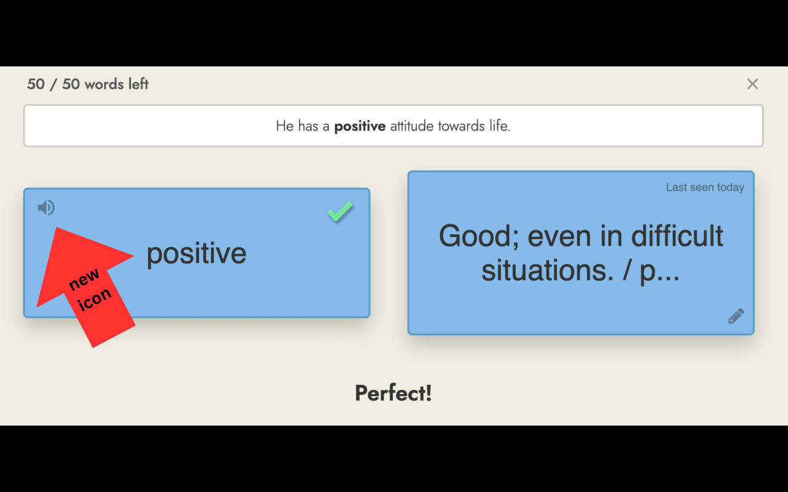

# ReadLang Speech Extension

A Chrome extension that provides text-to-speech functionality for ReadLang using OpenAI's TTS API.

## Screenshots

### Extension Popup

### In-Action Preview

## Features

- Real-time text-to-speech conversion of selected text
- Multiple voice options (Alloy, Echo, Fable, Onyx, Nova)
- Audio caching for improved performance
- Replay functionality for last spoken text
- Cache management system

## Installation

1. Clone this repository
2. Open Chrome and navigate to `chrome://extensions/`
3. Enable "Developer mode" in the top right
4. Click "Load unpacked" and select the extension directory

## Configuration

1. Click the extension icon to open settings
2. Enter your OpenAI API key
3. Select your preferred voice
4. Click "Save Changes"

## Required Permissions

- `activeTab`: For accessing page content
- `storage`: For saving user preferences
- Access to `api.openai.com` for TTS functionality

## Usage

The extension automatically detects text in ReadLang's word cards and context areas, converting them to speech using OpenAI's TTS API.

### Features:
- Click the replay button to repeat the last spoken text
- Clear audio cache through the settings panel
- Monitor cache usage in the settings

## Technical Details

- Built with vanilla JavaScript
- Uses Chrome Extension Manifest V3
- Implements IndexedDB for audio caching
- Supports OpenAI's TTS-1-HD model

## Dependencies

- OpenAI API (requires API key)
- Chrome Browser
